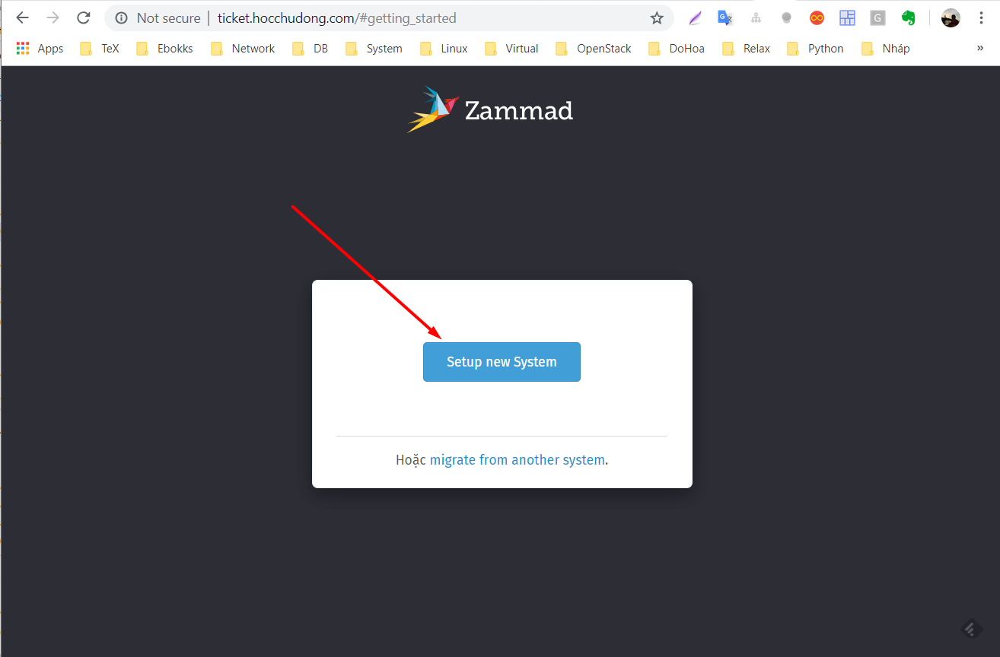
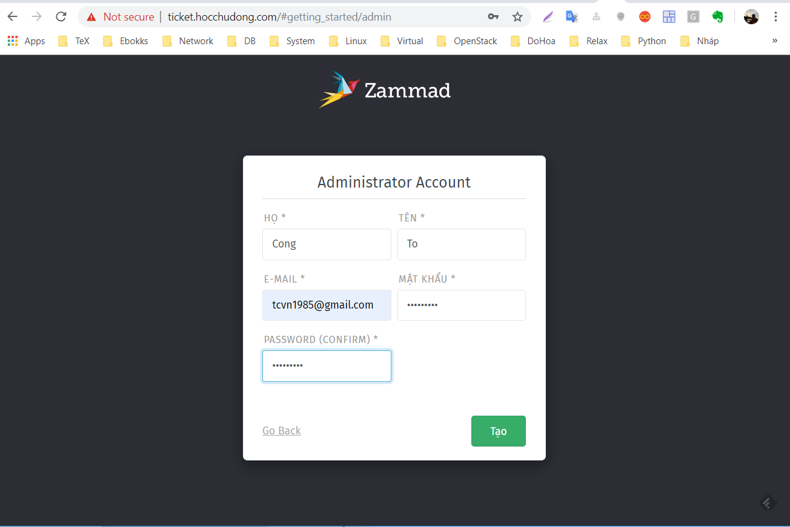
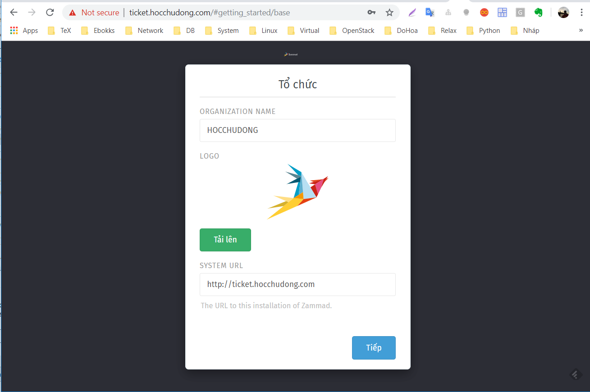
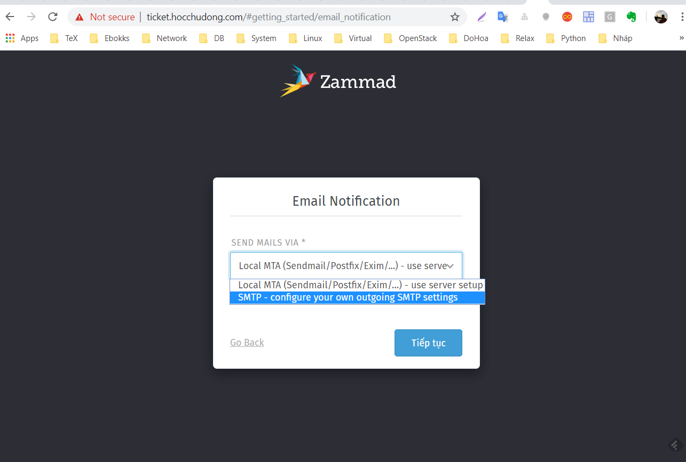
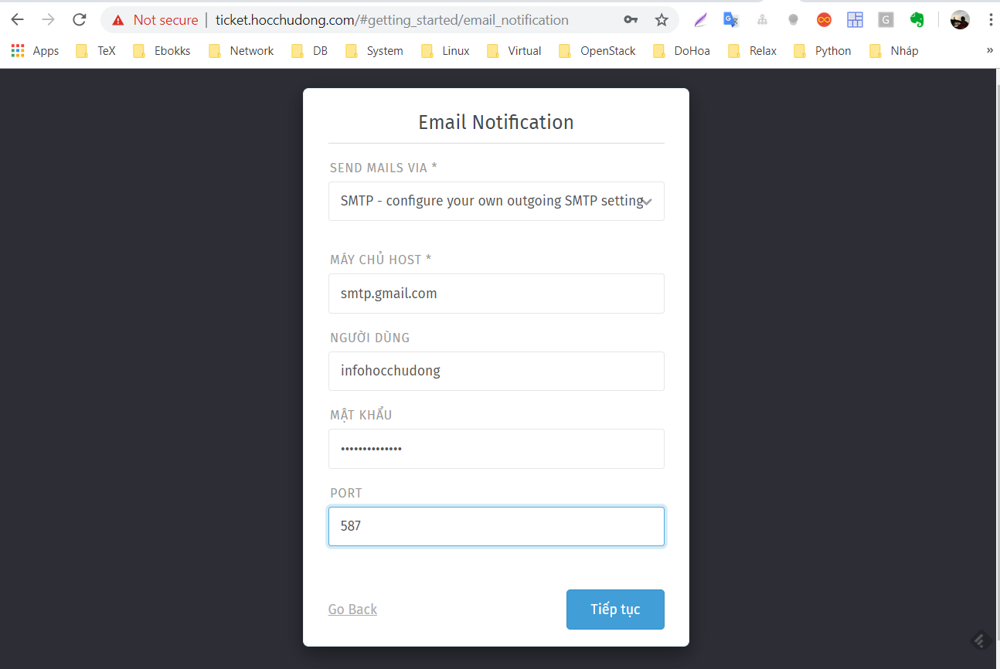
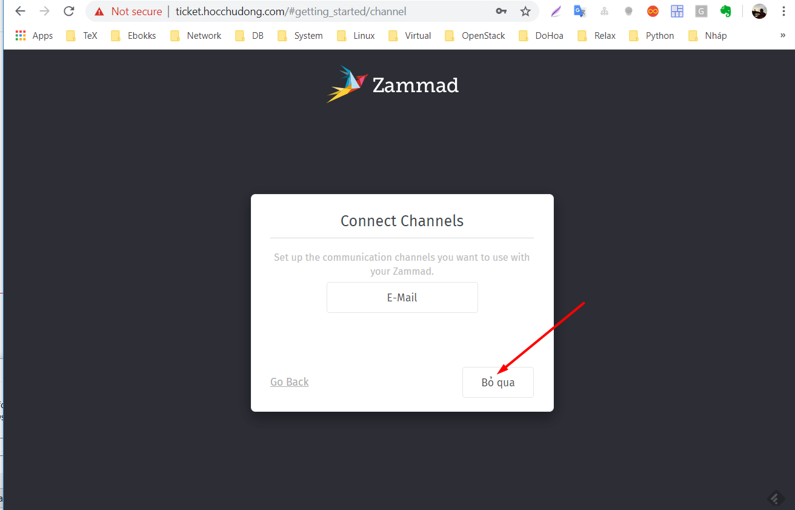

## Hướng dẫn cài đặt ZAMMAD TICKET

### Giới thiệu

Ngoài các tính năng phải có của TICKET thì ZAMMAD đã cung cấp thêm:

- Là nền tảng để triển khai hệ thống TICKET. Tương đương với vai trò như của các sản phẩm OSTicket.
- Tích hợp với các kênh như web, facebook, telegram để nhận và tương tác ticket. Tức là cung cấp cơ chế nhận TICK qua nhiều kênh chứ không phụ thuộc vào UI của web.
- Xem lịch sử ticket.
- Tích hợp sẵn hệ thống livechat và cung cấp thông tin để tích hợp.
- Sử dụng elasticsearch.
- Cung cấp API, phù hợp tích hợp vào các giải pháp hiện có.
- Có bản OpenSource

### Chuẩn bị

#### Bắt buộc
- 01 Máy chủ CentOS 7 - 64 bit, có kết nối internet.  Cấu hình tối thiểu: 4GB RAM, 02 CPU, 20GB Disk. Nên dùng RAM 4GB vì khi cài elastic sẽ có cảnh báo về RAM nếu thấp hơn.

- Sử dụng IP public, trong ví dụ này sẽ dùng IP: `157.230.99.32`

- 01 địa chỉ email (có thể sử dụng gmail) để làm email gửi thông báo khi đăng ký tài khoản, khi gửi thông báo hàng hoạt tới người dùng. Trong ví dụ này sẽ dùng email infohocchudong@gmail.com và thiết lập chế độ cho phép đăng nhập ít bảo mật của gmail để thực hiện test (https://myaccount.google.com/u/2/lesssecureapps). Đối với công ty thì nên dùng mail với tên miền của công ty thì uy tín hơn :).


- 01 hoặc nhiều địa chỉ email của các group trong công ty, ví dụ `sales@hoccchudong.com, tech@hocchudong.com ...`. Đây là các email để khi có ticket thì sẽ gửi thông tin cho người dùng. Lưu ý đây là tài khoản email chứ không phải mail alias.

#### Tùy chọn
- 01 tên miền và khai báo subdomain, ví dụ ticket.hocchudong.com
- 01 hoặc nhiều bot của telegram
- 01 tài khoản facebook app

### Các bước cài đặt

#### Thiết lập IP và cấu hình firewall

- Trong quá trình lab thì không cần đặt IP tĩnh và có thể tắt iptables.
- Khuyến cáo bật Iptables và mở các port cần thiết.


#### Cài đặt các gói bổ trợ.

- Update và cài đặt các gói bổ trợ sử dụng trong quá trình cấu hình.
	```
	yum install epel-release -y
	yum update -y

	yum install wget byobu -y
	```
	
- Đặt hostname cho server

```
hostnamectl set-hostname ticket
```	

- Cài đặt java
```
rpm --import https://artifacts.elastic.co/GPG-KEY-elasticsearch
```

- Khai báo repo của elastic

```sh
echo "[elasticsearch-5.x]
name=Elasticsearch repository for 5.x packages
baseurl=https://artifacts.elastic.co/packages/5.x/yum
gpgcheck=1
gpgkey=https://artifacts.elastic.co/GPG-KEY-elasticsearch
enabled=1
autorefresh=1
type=rpm-md" | sudo tee /etc/yum.repos.d/elasticsearch.repo
```

- Cài đặt elastic
	```
	yum update -y

	yum -y install java elasticsearch
	```

- Cài đặt plugin cho elastic để hỗ trợ zammad
	```
	/usr/share/elasticsearch/bin/elasticsearch-plugin install ingest-attachment
	```

- Khởi động và kiểm tra hoạt động của elastic và kích hoạt.
	```
	systemctl daemon-reload
	systemctl enable elasticsearch
	systemctl start elasticsearch
	systemctl status elasticsearch
	````

- Khởi động lại máy chủ

	```
	init 6
	```
	
#### Cài đặt và cấu hình zammad

- Cài đặt zammad

```
wget -O /etc/yum.repos.d/zammad.repo https://dl.packager.io/srv/zammad/zammad/stable/installer/el/7.repo

yum -y install zammad
```

- Sửa dòng `server_name localhost` thành server_name ticket.hocchudong.com của  file ` /etc/nginx/conf.d/zammad.conf` để có thể vào được bằng domain. Dùng lệnh `sed` để sửa.


```
sed -i s'/localhost/ticket.hocchudong.com/'g  /etc/nginx/conf.d/zammad.conf
```


#### Cài đặt 
#### Khai báo các cấu hình cơ bản cho zammad

- Lưu ý: Trước đó cần trỏ domain ticket.hocchudong.com với địa chỉ IP `157.230.99.32`

- Đăng nhập vào domain `htts://ticket.hocchudong.com` để thực hiện thiết lập ban đầu cho ZAMMAD

- Chọn `Setup new System`



- Khai báo tên và email quản trị. Lưu ý đây là tài khoản admin của hệ thống.




- Khai báo tên công ty và lựa chọn logo nếu bạn muốn.



- Lựa chọn khai báo Server mail để gửi thông báo. Đây là email thông báo khi xác thực người đăng ký hoặc các email từ hệ thống. Lưu ý nó khác với email của các group trên hệ thống ticket.

- Do mình chọn một SMTP ở bên ngoài (trong ví dụ này là của gmail) nên sẽ chọn như ảnh. Nếu bạn muốn chính máy cài zammad gửi thì chọn ngược lại. Đối với phần gửi local thì sẽ vào spam nên không khuyến cáo.



- Nhập thông tin về tài khoản email dùng để gửi thông báo, trong ví dụ này chọn email `infohocchudong@gmail`. Cần bật chế độ đăng nhập từ nhiều thiết bị (cho phép chế độ bảo mật kém của gmail).




- Bỏ qua bước tạo các channel (sau này sẽ thiết lập sau).




- Hoàn thành bước thiết lập ban đầu, chuyển sang bước khai báo các phần để sử dụng trong thực tế.
